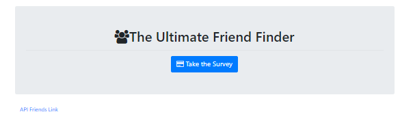
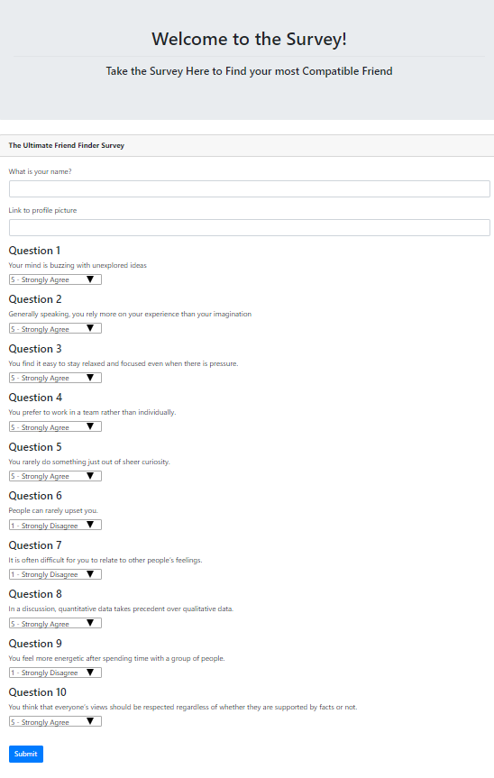

# The Friend Finder Application
June 2019

## About the Friends Finder Application

The following application leverages npm express to route to different html files and/or APIs to ultimately use GET and POST methods to parse incoming data.

Users are prompted to take a short 10 question personality quiz. Data, via a POST method, is sent to the server for processing. Processing consists of comparing user scores, stored in an array of objects generated by user participation, to one another to find users with the most compatible personalities, measured according to their survey score. 


## Running the Application

The application is hosted but can also be run from a local server (8080).
Running a local server requires the following code in the terminal:
```
nodemon server.js
```

## See screenshots below of the brief user experience

### home path output


### survey path output


